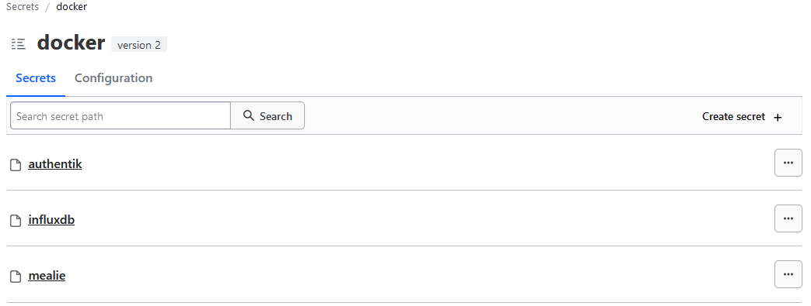

# Ansible Docker Management 

This set of playbook is aimed to manage docker containers in one or multiple virtual machines.
The goal is to have a defined set of containers as a code and deploy them via ansible ( or delete as needed ).
Ideally, we'll not need to do any modification on the host, nor manage the containers via portainer or dockge. I user portainer to see what is happening visually and correct my code as needed then redeploy the containers.

## The Structure

### The roles
* Ensuring that all defined containers are deployed via : `docker_deploy_containers`
  * This role make sure that all the containers that you want to be deployed on your hosts are deployed, and if not, it will do it. You can run this role as many time you want, if nothing changed, nothing *should* happen. ( Note: sometimes, the task copy the files, it's not a big deal, but it's on my to-do to fix)

### Host_vars | docker-compose.yml
* Make sure to create directories that matche the virtual machines / docker hosts namdes in the `inventory.yml` file.
* Create a directory with the name of the container you want to deploy on a specific host.
* For example if you want to deploy `mealie` on `docker-host-04`:
  * `mealie` will be considered as the `container_name` in the roles and used as the source for the docker-compose project.
  * Add you `docker-compose.yml` file inside the directory for mealie.
  * It will look like this : `ansible_docker_management/host_vars/docker-host-04/mealie/docker-compose.yml`
  * Then if you are using Hashi Corp Vault, you create a secret engine called `docker`, and a secret called `mealie`
  * Add all the secret variables, like your `OIDC_CLIENT_ID` and `OIDC_CLIENT_SECRET` if using Authentik like me.
  * Then either use the `docker_deploy_containers` role or the `docker_update_containers` role and adapt your playbook as such.

### Containers files
If your containers has configuration files, like homepage or traefik:
* Create a directory that matches the one on the host_vars in `files/containers`:
  * For homepage it'll look like: `ansible_docker_management/files/containers/homepage/services.yml` for example.
  * You can then modify the files are needed
  * If you are deploying the container for the first time, the `docker_deploy_containers` role should copy the files in the right place on the docker-host.
  * If you are updating the files, you can use the `docker_sync_files` role to simply make a copy of your current directory to the docker host that has the container.
* For information the current roles do not remove files that have been removed from the playbook. For example if you have a file in homepage that you remove, and you sync the files, it'll still exist on your docker-host.
* The role: `docker_remove_container_files` will remove ALL files in `/opt/docker-data/container_name`
  * If you have a container that created new files, a database etc.. it'll remove them.
  * I am working on updating the role to make a proper synchrnisation of the files without destroying files.

### Hahicorp vault
This is what it looks like in the vault:
